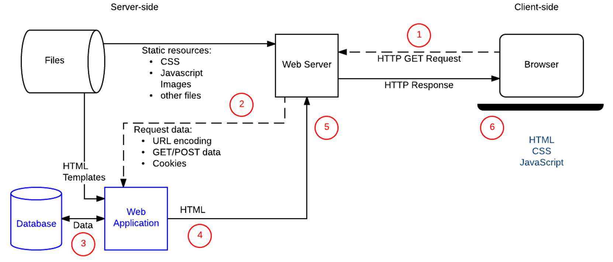

# Your Tribe for Life

## Live Rendering

Over het weergeven van informatie uit Directus door middel van Sveltekit. 

### Doel van de opdracht

- Je kunt data ophalen vanuit Directus en tonen in je SvelteKit project
- Je kunt filteren in de data van Directus
- Je kunt verder met het ontwikkelen van je squad page met dynamische data

### Werkwijze

Vorig jaar hebben jullie al gewerkt met dynamische data vanuit Directus. Toen met een node server.js en templates in liquid. 

_Herinner je deze flow nog?_

Dit jaar gaan jullie aan de slag met het framework Svelte met SvelteKit. In SvelteKit is het ook mogelijk om met dynamische data van Directus, of andere API's, te werken. 

Om dit mogelijk te maken heb je nodig:

1. Directus endpoint
2. Data verwerken in SvelteKit

### Directus endpoint

Directus heeft een endpoint voor de squads en personen. Hierin kun je per jaar de squads bekijken en op die manier dus jouw squad vinden. 

**🛠️ Opdracht**: 

1. Bekijk de endpoints van Directus, en filter hieruit de 'squads' voor '2526': https://fdnd.directus.app/items/squad, https://fdnd.directus.app/items/person

2. Nu je de squads hebt kun je de personen ophalen en hun data.

3. Maak deze experimenten:

👉 Experiment 1: Een lijst van mensen gesorteerd op name, asc

👉 Experiment 2: Een lijst van mensen die beginnen met de letter D

👉 Experiment 3: Een lijst met mensen die niet beginnen met de letter K

👉 Experiment 4: Een lijst van mensen die geboren zijn voor 2000

👉 Experiment 5: Een lijst van mensen die geboren zijn tussen 2000 - 2008

👉 Experiment 6: Haal een lijst van alle unieke fav_tag op, en laat zien hoeveel mensen die tag hebben

👉 Experiment 7: Haal een lijst op van iedereen met de role "squad_leader"

_💡 ProTip: Lees nog eens de [instructies](https://github.com/fdnd-task/server-side-rendering-server-side-website/blob/main/docs/data-filtering-en-template-filters.md) van jaar 1 door als je bent vergeten hoe filteren werkt._

#### Extra bronnen
- [Directus API docs](https://directus.io/docs/api)
- [Guide om met filter rules om te gaan @ Directus API docs](https://directus.io/docs/guides/connect/filter-rules)

### Data verwerken in SvelteKit

SvelteKit werkt op basis van folder based routing. Dus al je routes zitten in 'mappen' (folders). De `GET` en `POST` requests worden onder water afgehandeld. Elke route heeft een o.a. een server en component (view) bestand. Data kan worden geimporteerd in de view van het component. 

**🛠️ Opdracht**: 

Maak een overzichtspagina en een detailpagina voor je project op basis van de RAP/PE principes voor vrijdag.

#### Extra bronnen:
- [Getting started @ Svelte docs](https://svelte.dev/docs/svelte/getting-started)

### 💪 Extra uitdagingen

- Zoek een manier om dezelfde data niet meermaals op te halen
- Begin component-based met het opzetten van je templates
- Genereer een lijst met squad_leaders in je templates

### Leervragen

Zet de antwoorden in je learning journal.

- Welke verschillen merk je tussen het ophalen van data in Node+Liquid (jaar 1) en in Svelte+SvelteKit?
- Waar liep je vast, en hoe heb je dat opgelost? 

